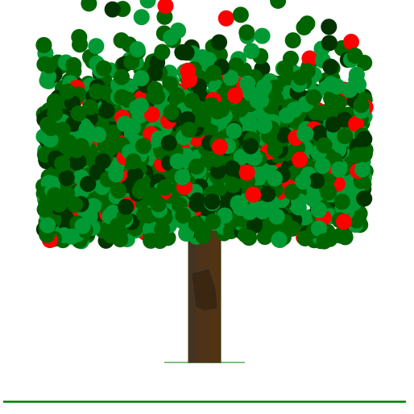
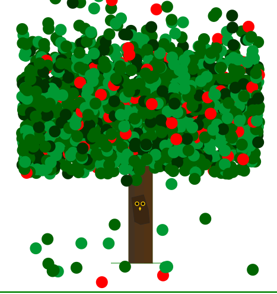

Assignment 1 - Hello World: GitHub and d3  
Josh Lovering

# Github pages link
[https://jalovering.github.io/01-ghd3/]

# Description:
For this assignment, I chose to create an apple tree to gain experience creating different primitives. I generated random data and use those points to create leaves, which required me to learn how to import data, similarly to creating a scatterplot.

Here is the first view of the project:

Here is a view showing the interactive aspects of the project:

# Referenced Code:
1. https://bl.ocks.org/d3noob/5680dd0089abdc5b15f188d5efe48852
    - I referenced this page to learn how to input my csv data to be used for plotting the leaves.

# Achievements
## Technical Achievement
The main technical achievement in this project was generating random data to represent the different leaves and apples on the tree. I used python to generate random x and y coordinates, as well as the 4 different leaf colors, and the apple color, at different proportions. These values were saved in a CSV, and then read into the script using d3.csv. I can use this process in the future to create scatterplots with CSV data. I expect uploading external data to d3 visualizations will be a readily used ability for me in the future.

## Design Achievement
I wanted to keep viewers engaged, and to do this I added a few interactive elements. The leaves have a 20% chance to fall when the moused over. Also, upon mousing over the hole in the tree, it's outline becomes lighter. I see this commonly used on websites, to indicate that this space can be clicked on. Once the viewer hovers over this and discovers that, they can click on it to make an owl appear.
For coloring, I looked up reference images of apple trees to match realistic colors. The trunk is made up of three subtly different colored rectangles to give it an illusion of being cylindrical. I created horizontal lines representing the forground and background, to give the image depth. The design of this project will keep the viewer engaged longer and through that I can spread my enjoyment of nature to anyone who finds this project.